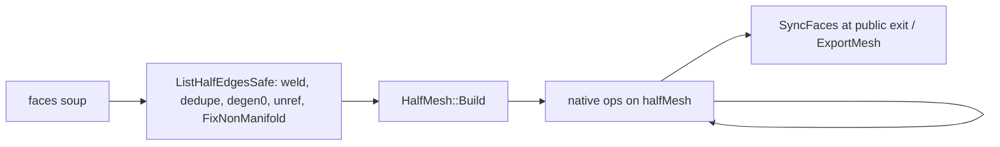

# Half-edge–primary mesh processing — implementation plan

Status: **planned** (hand-off to the halfmesh repo agent) · Branch: `openmvs-integration`
Driven by the OpenMVS `Mesh::Clean` integration; measured numbers below are from
Tanks&Temples *Truck* (6.1M faces) via `ReconstructMesh --mesh-file` clean-only runs.

Correction pass (2026-08-24): FAdd harvest, FRemoveBulk pinch vertices,
public-API `SyncFaces`, Remesh’s live `faces` array, M0 `Clear()` coupling,
dual ingest/native variants, and `RemoveSmallComponents` are folded into the
sections they belong to. Implement this document, not an earlier draft.

## 1. Problem

`Mesh` carries two topology representations: the `faces` array and `halfMesh`
(connectivity-only: `vHalfedges`, `fHalfedges`, `heNexts`, `heVertices`, `heFaces`;
positions always live in `Mesh::vertices` — only *faces* is duplicated state).
The algorithms split into two families:

- **Half-edge-native** — `Simplify` (MeshSimplify.cpp), `RemeshIsotropic`
  (MeshRemesh.cpp), `Smooth*` (positions only). They mutate through
  `ERemove`/`ESplit`/`EFlip` and resync the array with `FFaces(faces)`.
- **Array-native** — everything in MeshRepair.cpp and MeshHoles.cpp
  (`RemoveSpuriousComponents`, `RemoveSpikes`, `CloseHoles`,
  `RemoveVerticesAndFill`, `RemoveDegenerateFaces`,
  `RemoveUnreferencedVertices`, `FixNonManifold`, `RemoveSmallComponents`, …).
  They do swap-pop/append surgery on `faces`/`vertices` (often via a *third*
  derived structure, `vertexFaces`) and end with `halfMesh.Clear()` — except
  several mutators (`RemoveDegenerateFaces`, `RemoveDuplicateFaces`,
  `RemoveFacesOutside`, `FixNonManifold`, `RemoveUnreferencedVertices`) that
  currently **do not** `Clear()` and rely on the count gate.

A pipeline that interleaves the families (OpenMVS `Clean`: spurious → spikes →
simplify → holes → smooth → remesh → finalize) pays a full `HalfMesh::Build`
at every family transition. `Build` is O(F) but heavy — an
`unordered_map<uint64,HIndex>` over ~3F edges ≈ **3 s per rebuild on Truck** —
and `Clean` pays 3–4 of them: hole closing costs 6.2 s before filling a single
hole, and total clean time is 21.7 s vs 13.4 s for the old CGAL path (which
built its connectivity once and mutated it in place through every stage).

Secondary problem: there is no sound way to know the two representations still
agree. The freshness gate in `Mesh::ListHalfEdges()` compares **both** vertex
and face *counts*, which still misses any count-preserving remap, so algorithms
must clear conservatively (`CloseHoles` even does a defensive `Clear()` +
rebuild on entry; its comment still says “caches by vertex count” and is stale).

## 2. Target architecture

**The half-edge is the working representation; `faces` is a derived snapshot.**

- `ImportMesh`/first `ListHalfEdges()` builds the half-edge **once**.
- Every topology-mutating algorithm that is half-edge-native operates on the
  half-edge and keeps it valid; none of them clears it.
- `faces` is regenerated on demand via `FFaces()` — **once per OpenMVS `Clean`**
  in `ExportMesh`, and **on every public library method return** so existing
  callers (`mesh.faces`, goldens, Python `n_faces` / `to_arrays`, Save) keep
  today’s contract. The expensive thing is `Build`, not `FFaces`.
- `vertices` (+ `vertexColors`) is always live: any primitive that removes a
  vertex swap-pops the position arrays in lockstep, exactly as
  `Mesh::ECollapse` already does around `HalfMesh::ERemove`.

`Mesh` is a public aggregate (`faces` is a public member). Empty-`faces`-as-flag
is a **pipeline** optimization, not a silent breaking change of the public API.



### 2.1 Validity contract (problem 2 — decision)

Two options were considered:
(a) a dirty flag set in the mutating primitives;
(b) topology-changing half-edge algorithms always drop the `faces` array, and
faces are regenerated once at the end.

**Decision: (b), with the empty `faces` array itself acting as the flag** — no
new state member at all — **plus a public vs pipeline split**:

1. `Mesh::InvalidateFaces()` (new, trivial): clears `faces` **and every
   face-keyed attribute** (`faceTexcoords`, `faceTexblobs`, `faceNormals`) plus
   `vertexFaces`. Called **after** a successful `ListHalfEdges()` by half-edge
   topology algorithms that will stop reading `faces`. **Never** call it before
   `ListHalfEdges()`: that would drop the only source of topology.
   `FillBoundaryLoops` already performs this invalidation today; make it uniform.
2. `Mesh::SyncFaces()` (new, trivial): `if (faces.empty() && !halfMesh.Empty())
   halfMesh.FFaces(faces);`. `FFaces` **appends** — only call it on an empty
   vector. Called by:
   - public method **exit** (`Simplify`, `RemeshIsotropic`, `CloseHoles`,
     repair ops, …) so callers still see a populated `faces`;
   - Save/IO, Python `to_arrays`, `ListVertexFaces`, `RemoveFacesOutside`,
     atlas/texture/BVH/KdTree entry — any code that iterates `faces`;
   - OpenMVS `ExportMesh` (the one `FFaces` that matters for Clean cost).
   An internal Clean pipeline may skip per-stage `SyncFaces` and do it once
   in `ExportMesh`.
3. Array-mutating algorithms (ingest-time repairs that stay array-native, §4.7)
   keep today's convention: mutate arrays, then **`halfMesh.Clear()`**. M0 must
   add the missing `Clear()` calls; the new `ListHalfEdges` gate is unsound
   without them.
4. `Mesh::ListHalfEdges()` gate becomes exact: `if (!halfMesh.Empty()) return;`
   — a non-empty half-edge is valid **by contract** (any array surgery cleared
   it; any native mutation maintained it). The count-comparison heuristic is
   deleted. Rebuild happens only from a non-empty `faces` array.
   `SyncFaces()` then `ListHalfEdges()` when HE is empty is a bug (nothing to
   rebuild from if faces were empty; if faces were stale-populated, you would
   skip a needed rebuild). Assert: `halfMesh.Empty() || !faces.empty()` is
   **not** required; half-edge-only is a legal mid-pipeline state.
   Assert on rebuild: `if (halfMesh.Empty() && faces.empty() && !vertices.empty())`
   is a contract violation (lost topology).

Class invariant (assert in debug at algorithm entry/exit):

```
faces.empty() || halfMesh.Empty() || faces.size() == halfMesh.FSize()
```

and, whenever `!halfMesh.Empty()`:

```
vertices.size() == halfMesh.VSize()
```

(the face-count clause alone misses a skipped vertex swap-pop).

States: *arrays-only* (fresh load, post-ingest-repair), *half-edge-only*
(mid-pipeline / internal Clean, faces dropped), *both-and-consistent*
(right after `Build` or `SyncFaces`, and after every public method return).
Nothing else is representable, which is the point.

`Mesh::Empty()` already allows vertices+HE with empty faces; keep that, and
stop treating `faces.empty()` as “the mesh has no triangles” in public methods
(`CloseHoles`, `Simplify`, Smooth, atlas, IO, Python `n_faces`). Early-out on
“no vertices, or both faces and HE empty”.

Option (a) was rejected because a `bool facesValid` member would have to be
touched in exactly the same set of functions while adding a second source of
truth that can contradict the arrays; (b) encodes the state in data that cannot
lie. Debug builds additionally get `ValidateHalfMesh()`: if `faces` is empty,
`FFaces` into a scratch vector first, `Build` into a scratch `HalfMesh`,
compare. Wire into the test corpus after each native op.

Note the OpenMVS `Clean` bridge (`MeshHalfMesh.cpp`, **OpenMVS-side**, not in
this repo — `include/halfmesh/InteropOpenMVS.h` is convert-only) then does
exactly: one `ImportMesh` → stages (no clears, no rebuilds, optional skip of
per-stage `SyncFaces`) → one `SyncFaces` in `ExportMesh`. One `Build` + one
`FFaces` per clean, total. Public halfmesh API still `SyncFaces`s on the way
out so goldens do not go red.

Dirty ingest today can pay **two** `Build`s (`ListHalfEdges` try-Build fails
and Clears, then `ListHalfEdgesSafe` Builds). Optional later: on first-Build
failure, go straight to Safe. Not required for Clean if OpenMVS manifoldizes
once up front.

## 3. New/changed HalfMesh primitives

### 3.1 `FRemoveBulk` — the workhorse (new)

```cpp
// Remove a set of faces in one pass, keeping the half-edge valid and manifold.
// Appends to removedVerts every vertex that lost its last face, in the same
// descending order VRemoveOnly uses, so the Mesh wrapper swap-pops vertices/
// vertexColors in lockstep (do not invent a second “application order”).
void FRemoveBulk(std::vector<FIndex>& faceRemoves, std::vector<VIndex>& removedVerts);
```

Algorithm, O(removed + affected-border):
1. Mark removed faces (bitset). Connectivity surgery uses **pre-compact**
   indices; compact last.
2. For every half-edge of a removed face whose twin's face survives, the twin
   edge becomes a border half-edge (`heFaces = NO_ID`); if both sides die, the
   edge dies (`ERemoveOnly` batch).
3. Vertices whose every incident face died are collected (`VRemoveOnly` batch +
   reported through `removedVerts`); survivors get `SetVHalfedge` repointed to a
   surviving out-half-edge.
4. **Pinch vertices:** if a surviving vertex would have two (or more) remaining
   fans, **duplicate the vertex and rewire one fan** — the same split
   `FixNonManifold` does on the soup. Do **not** “keep one fan and close the
   other through `ConnectBorders`”. `Build` **rejects** bow-ties; a single
   `vHalfedges[v]` cannot represent two fans; `ConnectBorders` does not split
   them. Leaving a pinch makes the later `FixNonManifold` short-circuit unsound.
   Scattered long-edge drops in `RemoveSpuriousComponents` can create this;
   whole-component removal cannot.
5. Re-link border `heNexts` by circulating each affected vertex — the same
   local rule `ConnectBorders(HIndex&)` implements; only vertices touched in
   (2)/(4) need visiting.
6. Compact with the existing descending-sort `FRemoveOnly`/`ERemoveOnly`/
   `VRemoveOnly` batch overloads (they were built for exactly this).

This is a **new** primitive, not a loop around `FRemove`. `FRemove` does not
support faces with more than one border-edge; bulk removal of scattered faces
**will** hit 2–3 border-edge triangles (`FRemoveCorner` exists for the single-
face case). Tests must include multi-border faces, pinches that require a
vertex split, scattered faces, whole components, all faces, and cascade to
isolated vertices — each checked with `ValidateHalfMesh`.

This subsumes the single-face `FRemove` + its `ConnectBorders`-discipline
footnotes and resolves the standing
`TODO(Dan): re-factor to keep connectivity and remove ConnectBorders requirement`.
Whole-component removal is the degenerate easy case (no new borders at all).

Mesh-level wrapper `Mesh::RemoveFacesHalfEdge(std::vector<FIndex>&)`: calls
`FRemoveBulk`, replays `removedVerts` as swap-pops on `vertices`/`vertexColors`
(mirror of `Mesh::ECollapse`, **same index order**), calls `InvalidateFaces()`.

### 3.2 `FAdd` isolated-vertex support (finish the existing TODO — and more)

`FAdd` already stitches a face onto border edges/vertices with full
`ConnectBorders` handling; it lacks
`TODO(Dan): add support for creating new vertices`. Extending it to accept
`vHalfedges[v] == NO_ID` is **necessary but not sufficient**:

- `VIsBoundary(v)` is `EHeIsBoundary(VHalfedge(v))`. Isolated verts have
  `VHalfedge == NO_ID`; today’s `ASSERT(VIsBoundary(face[v]))` **OOB-crashes**,
  it does not fail softly. Isolated verts must be a first-class legal corner
  (skip `VIsBoundary`; do not index `heFaces[NO_ID]`).
- `numNewEdges[v] > 1 → return NO_ID` rejects the actual grow step: a triangle
  that shares **one** existing boundary edge and a new (or isolated) third
  vertex creates **two** new edges at that vertex. Isolated vertices **must be
  allowed two new edges**. Existing boundary vertices keep the ≤1-new-edge
  rule (that is the non-manifold-vertex guard).

Caller still pre-appends positions to `Mesh::vertices` and `NO_ID` slots to
`vHalfedges`.

**Hole harvest must not assume BFS-from-one-edge always passes `FAdd`.** A
triangle sharing only one edge is exactly the `numNewEdges==2` case. Two
workable orders:

- **Ear-clip / two-existing-edges** (works with *today’s* `FAdd` for
  boundary-only patches — no Steiner verts).
- **Retry queue**, already implemented by `HalfMesh::TriangulateHole`: walk the
  DP tree, `FAdd`, on `NO_ID` enqueue and retry. Reuse that pattern (or call
  `TriangulateHole` for the no-Steiner case). Do not invent a weaker BFS
  attacher.

`RemoveVerticesAndFill` uses `refine=false` (boundary-only) — retry/ear-clip
is enough. `CloseHoles` uses Liepa+refine (interior Steiner verts) — that path
**requires** the isolated-vertex + two-new-edges `FAdd` extension, or a bulk
`FAddDisk` that attaches a pre-triangulated patch.

If a pathological patch is still rejected, skip that hole — same outcome as
today’s `ok[j]==0` path.

### 3.3 Unreferenced-vertex sweep (new, trivial)

`VRemoveUnreferenced(std::vector<VIndex>& removedVerts)`: one pass over
`vHalfedges`, batch `VRemoveOnly` every `NO_ID` slot, report for lockstep.
Replaces the `vertexFaces`-based `Mesh::RemoveUnreferencedVertices` **inside
native pipelines**. Keep the array implementation for `ListHalfEdgesSafe`
(there is no HE yet). Successful `Build` currently debug-asserts no `NO_ID`
vHalfedges, so ingest must still unref on the soup before `Build`.

## 4. Per-operation conversion audit

Each stage of the OpenMVS `Clean` pipeline, current vs. native design, and the
speed verdict.

**Faces-domain (ingest / triangle soup only)** — cannot be represented in a
valid half-edge; run via `ListHalfEdgesSafe` (or explicitly before first
`ListHalfEdges`), then never again on a live HE:

- `RemoveDuplicateVertices` / `RemoveDuplicateFaces`
- `RemoveDegenerateFaces(0)` — repeated indices only
- `RemoveUnreferencedVertices` — pre-`Build`
- **`FixNonManifold`** — splits multi-fan vertices (bow-ties). This is the
  manifoldizer; a valid HE cannot store what it fixes.
- IO, `RemoveFacesOutside`, atlas/texture (read `faces` after `SyncFaces`)

`ListHalfEdgesSafe` is the **one** orchestrator of that sequence, then `Build`.
`FixNonManifold` is the headline ingest op, not the only one.

**Half-edge-domain** — must not `Clear()`:

- Simplify, Remesh, Smooth, CloseHoles, RemoveVerticesAndFill
- RemoveSpuriousComponents, **RemoveSmallComponents**, RemoveSpikes
- geometric degenerate cleanup, native unref

### 4.1 `RemoveSpuriousComponents` — native, strictly faster

Current: edge-length percentiles over half-edge edges (already native), then
long-edge faces via **array scan** + `RemoveFaces` + `RemoveUnreferencedVertices`
+ **full rebuild**, then `ConnectedComponents` (native) + component removal via
array surgery + final `Clear()`. Pays ~2 rebuilds.
Native: percentiles unchanged; long-edge faces found by iterating half-edge
edges directly (the loop at the top already computes every edge length —
collect the incident faces of over-long edges there); remove via `FRemoveBulk`
(pinch-split may fire); `ConnectedComponents` unchanged; component removal via
`FRemoveBulk` (easy case). Zero rebuilds, no `vertexFaces`.

### 4.1b `RemoveSmallComponents` — native, same pattern (was omitted)

Current: `ListHalfEdges` → `ConnectedComponents` → swap-pop faces below
`minComponentSize` → `RemoveUnreferencedVertices` → `Clear()`. Same bug as
spurious; on goldens, Python, and the repair suite. Convert with `FRemoveBulk`
(whole-component = easy case) in M2. Leaving it array-native reintroduces a
`Build` if anything calls it between native stages.

### 4.2 `RemoveSpikes` — native, strictly faster

Current: per-iteration `ListVertexFaces()` (full O(V+F) rebuild of the third
representation), scan for vertices with ≤1 incident face, `RemoveVertices(…,
true)`, final `Clear()`.
Native: a spike vertex is detected by circulating `vHalfedges[v]` — valence-1
(one incident face) or isolated (`NO_ID`). First pass O(V); collect the
incident faces, `FRemoveBulk`. Cascade via a **worklist**: only neighbours of
removed faces can become spikes, so iterations after the first are O(affected)
instead of O(V).

### 4.3 `CloseHoles` / `RemoveVerticesAndFill` — native, strictly faster

Current: defensive `Clear()`+`Build` on entry, native loop enumeration, Liepa
fill computed per-hole on local copies (already isolated — keep as is), then
harvest **appends to `vertices`/`faces`** and ends with `Clear()` (+ another
`Build` when `rebuildHalfMesh`). Two full rebuilds to fill holes whose patches
total a few thousand triangles. Entry also early-outs on `faces.empty()` —
under half-edge-only that would skip filling; change the early-out (M0).
Native: entry rebuild deleted (the §2.1 contract makes it unnecessary);
`RemoveVerticesAndFill`'s removal phase uses `FRemoveBulk`; harvest appends
interior vertices (positions + `NO_ID` `vHalfedges` slots) and adds patch
triangles via `FAdd` using **`TriangulateHole`’s retry queue and/or ear-clip
order**, not “BFS so one shared edge suffices” (that order fails current
`FAdd`; see §3.2). Steiner verts from refine need the isolated+two-new-edges
`FAdd`. `holesFaces` indices remain valid after a later `SyncFaces` because
`FAdd` appends and `FFaces` walks `fHalfedges` in index order.

### 4.4 `RemoveDegenerateFaces` — native, equal-or-faster (not bit-identical)

Current: `vertexFaces`-based scan + face removal + manual vertex-welding via
index remaps (an ad-hoc edge collapse), iterated up to `maxIterations`. The
array welder does **not** run Hoppe link / fold checks and can create
non-manifoldness (the header already says follow with unref + `FixNonManifold`).
Native: scan faces for area ≤ threshold via `fHalfedges` (positions from
`Mesh::vertices`); **needles** → `ERemove` (collapse shortest edge, existing
validity checks); **caps** → `EFlip` the long edge (existing) or collapse;
duplicate-index faces cannot exist inside a valid half-edge (Build rejects
them), so that branch survives only in the array-native ingest variant
(`RemoveDegenerateFaces(0)` inside `ListHalfEdgesSafe`).

The welding semantics *are* edge collapses, but native `ERemove` will **refuse**
some welds the array path performs. Do **not** promise identical removed counts
on goldens. Keep the array `RemoveDegenerateFaces(0)` for Safe. Native
geometric degenerates are best-effort; expect golden regen and weaker
metamorphic checks (Hausdorff / leftover-area), not bit-identity.

Degenerate counts are tiny, so per-element `ERemove` cost is irrelevant; the
win is deleting the `ListVertexFaces` + post-hoc rebuild.

### 4.5 `RemoveUnreferencedVertices` — native, trivial (§3.3), ingest array variant kept

### 4.6 `FixNonManifold` — ingest-only (faces-domain)

A valid half-edge **is** a manifoldness certificate: the structure cannot
represent non-manifold topology, `Build` detects violations and falls back to
the repairing `ListHalfEdgesSafe`, and every native mutator preserves
manifoldness **only if `FRemoveBulk` splits pinches** (§3.1). So inside a
native pipeline `FixNonManifold` short-circuits:
`if (!halfMesh.Empty()) return 0;`.

The array implementation stays, used at ingest via `ListHalfEdgesSafe` (which
`Clear()`s first, so the short-circuit does not fire there). Do not re-run it
as a Clean finalize stage; if OpenMVS still calls it, it is a cheap no-op
after a native pipeline.

`IsManifold()` is edge-only and **insufficient** for `Build` (bow-ties pass
it). Do not substitute it for `Build`’s return value.

### 4.7 Deliberately left array-native

`RemoveDuplicateVertices`, `RemoveDuplicateFaces`, `RemoveFacesOutside`, IO,
and the atlas/texture pipeline consume or repair raw arrays (pre-half-edge
ingest, or read-only scans). They call `SyncFaces()` on entry (read-only ones)
or keep the mutate-then-`halfMesh.Clear()` convention (repairs). No conversion;
they are not on the `Clean` hot path. Atlas/KdTree/BVH/`ComputeFaceNormal(FIndex)`
all iterate `mesh.faces` — they are array consumers, not a reason to keep
repair native.

### 4.8 `Simplify` / `RemeshIsotropic` / `Smooth*` — already native; epilogue is *not* a free cleanup

**Do not** replace their `FFaces` with `InvalidateFaces()` on entry in M0/M5
as an earlier draft stated.

- **Simplify** still reads `faces` to assemble quadrics **before** it empties
  them. Invalidate-on-entry breaks setup unless quadrics walk `fHalfedges`.
  After setup it already empties `faces` and `FFaces`s at the end — public
  `SyncFaces` on exit matches that.
- **Remesh** keeps `faces` **live** for crease tags, `fvSelection`
  (`faces.size()*3`), collapse/flip tests, mid-pass `FFaces` after split and
  after collapse, and `RemeshData` copies `originalMesh` for the projection
  BVH at construction. Emptying `faces` on entry empties that BVH. Treat
  “Remesh stops reading `mesh.faces`” (walk `HalfMesh::F(i)` / half-edges
  instead) as **its own milestone**. Until then Remesh must keep resyncing
  `faces` after split/collapse even if the rest of the pipeline is
  half-edge-primary.
- **Smooth*** touches positions only. If faces were populated, they stay
  valid (topology unchanged) — call neither Invalidate nor Sync. If a
  pipeline left faces empty, Smooth must **not** early-out on `faces.empty()`;
  it still needs HE for adjacency.

Public Simplify/Remesh still `SyncFaces` (or keep today’s `FFaces`) on exit
until the OpenMVS pipeline opts out. The Clean win is **zero extra `Build`s**.

## 5. Milestones

Each lands independently, tests green (`ctest`: 507/507 today) before the next.
M0 is **not** behavior-neutral unless the `Clear()`s, early-out rewrites, and
public `SyncFaces` land in the **same** milestone as the new `ListHalfEdges`
gate.

- **M0 — contract.** `InvalidateFaces()` + `SyncFaces()` + exact
  `ListHalfEdges()` gate + class invariant asserts (faces **and**
  `vertices.size()==VSize()`) + debug `ValidateHalfMesh()` (harvest then
  rebuild). **`halfMesh.Clear()` on every array mutator** that currently
  forgets it. Rewrite `faces.empty()` early-outs. `SyncFaces()` at every
  public method exit and in Save/IO/Python. Wire `SyncFaces()` into remaining
  array consumers (grep for `faces` iteration). **Do not** drop
  Simplify/Remesh `FFaces` yet. Order inside native ops: `ListHalfEdges()`
  first, then optionally `InvalidateFaces()`.
- **M1 — bulk primitive.** `FRemoveBulk` (pinch = vertex split, multi-border
  faces, descending `removedVerts`) + `Mesh::RemoveFacesHalfEdge` +
  `VRemoveUnreferenced` + `FAdd` isolated-vertex **and two-new-edges**.
  Reuse `TriangulateHole` retry for disk attach. Unit tests vs from-scratch
  rebuild (`ValidateHalfMesh`).
- **M2 — repair family.** §4.1 spurious + §4.1b **small components** + §4.2
  spikes native.
- **M3 — holes family.** §4.3 native harvest; delete the defensive entry
  rebuild in `CloseHoles`.
- **M4 — finalize family.** §4.4 native geometric degenerates (array `(0)`
  kept for Safe) + §4.5 native unref (array kept for Safe) + §4.6
  `FixNonManifold` short-circuit.
- **M5 — Remesh (and Simplify setup) off `mesh.faces`**, then allow the
  OpenMVS pipeline to skip per-stage `FFaces`. Update `docs/FEATURES.md` +
  `AGENTS.md` (the representation-authority contract is a standing convention
  from then on). FEATURES still documents “faces primary, HE on demand”.

Perf gates (add to the `HALFMESH_BUILD_PERF` suite so they are repeatable):
- `Build`-count per simulated Clean pipeline == 1 (instrument with a counter).
  Do not gate on “no `FFaces`” until M5.
- Truck-scale synthetic (≥5M faces): spurious+spikes+holes end-to-end must not
  regress vs. the M0 baseline, and holes-with-zero-fills must cost ~0 (today:
  6.2 s of pure rebuild).
- OpenMVS side (run by the OpenMVS agent after M5): `Clean` wall time on Truck
  ≤ 13.4 s (old CGAL path), F1 parity via the paired `--mesh-file` A/B harness.

Correctness gates:
- Metamorphic old-vs-new per converted op on the test corpus: identical removed
  counts on manifold inputs **where semantics match**; Hausdorff ≈ 0 on
  surviving geometry. Degenerate conversion is exempt from count identity.
- OpenMVS `Tests.exe 2` (mesh suite) green with the rebuilt library.

## 6. Risks / notes

- `FRemoveBulk` border relinking is the only genuinely subtle code (step 5 of
  §3.1); it reuses `ConnectBorders(HIndex&)` logic per affected vertex —
  validate exhaustively against rebuilds in M1 before anything builds on it.
- Bulk removals that slice a component in two are fine (no global bookkeeping
  is kept). Removals that create a pinch vertex **must split the vertex**
  (§3.1 step 4). Add an explicit pinch test; `ConnectBorders` is not a fix.
- Attribute arrays (`faceTexcoords` etc.) are *dropped* on topology change,
  matching today's `FillBoundaryLoops` behavior — the UV/texture pipeline runs
  before or after, never across, a topology-mutating pass. Assert-empty at the
  entry of native mutators to make the assumption loud. `SyncFaces` does not
  restore dropped UVs.
- `GuaranteeAlwaysEven` harvests faces from the **half-edge** via `FFaces`,
  not from `Mesh::faces`. Empty mesh faces do not break it.
- `HALFMESH_TRIS == 1` only, as everywhere else in the OpenMVS integration.

## 7. vcpkg port policy (both repos)

**The port must never touch the library.** We own both repos: any source change
lands as a commit on `openmvs-integration` in *this* repo, never as a port
patch. (`ports/halfmesh/openmvs-integration.patch` in OpenMVS was exactly that
anti-pattern; it also went stale silently.)

- **This repo** now carries `vcpkg-overlay-ports/halfmesh/`: a portfile that
  builds straight from this working checkout (`SOURCE_PATH` = repo root,
  resolved relative to the port dir — no download, no patches, no SHA).
  Dev loop against OpenMVS:

  ```
  vcpkg install --triplet x64-windows --x-manifest-root=<openMVS> \
    --x-install-root=<openMVS>/make/vcpkg_installed \
    --overlay-ports=C:/Pro/halfmesh/vcpkg-overlay-ports \
    --overlay-ports=<openMVS>/ports --no-binarycaching
  ```

  `--no-binarycaching` is required: vcpkg hashes the portfile, not the source
  tree, so the cache would serve stale binaries after a source-only edit. The
  overlay's `port-version` is set to 999 so it always out-ranks the OpenMVS
  registry port.
- **OpenMVS repo** (after this plan ships): tag `v0.3.0` here, then point
  `ports/halfmesh/portfile.cmake` at that tag (`REF v${VERSION}` + real
  SHA512), **delete `openmvs-integration.patch`** and the `PATCHES` clause,
  reset `port-version` to 0 with the version bump.
